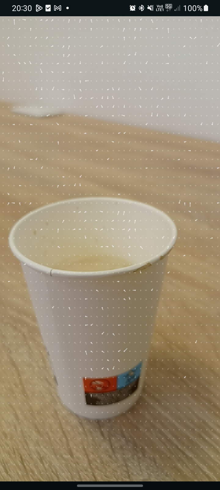

# OptiFlux App

A real-time optical flow visualization app for Android that computes and displays motion vectors from the camera feed using native C++ implementation of the Lucas-Kanade algorithm.

## Features

- **Real-time Optical Flow Computation**: Calculates dense motion vectors from camera frames using Lucas-Kanade method
- **Native C++ Implementation**: High-performance optical flow calculations using JNI
- **Dual Camera Support**: Works with both front and back cameras with automatic orientation handling
- **Visual Flow Representation**: Color-coded vectors showing motion magnitude and direction
  - Filtered out: Very low (< 1.0) or aberrant (> 6.0) motion
  - White (60% opacity, 2px): Medium motion (1.0 - 3.0)
  - White (100% opacity, 4px): High motion (> 3.0)
- **Adaptive Resolution**: Automatically handles different camera resolutions with proper viewport scaling
- **Rotation Aware**: Correctly transforms flow vectors for any device orientation with crop compensation

## Demo

<div align="center">
  <table>
    <tr>
      <td align="center">
        
        <br/>
        <em>Optical Flow Visualization</em>
      </td>
      <td align="center">
        <video src="captures/with_camera_view.mp4" width="280" controls>
          <a href="captures/with_camera_view.mp4">View Demo Video 1</a>
        </video>
        <br/>
        <em>With Camera View</em>
      </td>
      <td align="center">
        <video src="captures/without_camera_view.mp4" width="280" controls>
          <a href="captures/without_camera_view.mp4">View Demo Video 2</a>
        </video>
        <br/>
        <em>Flow Overlay Only</em>
      </td>
    </tr>
  </table>
</div>

> **Note**: If videos don't play inline, click the links above to view them directly.

## Technical Details

### Architecture

- **Language**: Kotlin + C++
- **UI Framework**: Jetpack Compose
- **Camera**: CameraX API
- **Native Layer**: JNI + CMake
- **Image Processing**: YUV plane extraction and grayscale conversion

### Optical Flow Algorithm

The app implements the **Lucas-Kanade** optical flow method:

1. **Sobel Gradient Calculation**: Computes spatial derivatives (∂I/∂x, ∂I/∂y)
2. **Window-based Accumulation**: Aggregates gradients over configurable windows
3. **Least Squares Solution**: Solves the optical flow equation using the structure tensor
4. **Velocity Vector Output**: Returns (u, v) motion vectors for each grid cell

**Default Parameters**:
- Cell Size: 12 pixels (grid spacing)
- Window Size: 5 pixels (neighborhood radius)
- Update Frequency: 10 Hz (100ms intervals)

### Project Structure

```
OptiFluxApp/
├── app/src/main/
│   ├── cpp/                          # Native C++ code
│   │   ├── jni_bridge.cpp            # JNI interface
│   │   ├── optical_flow_calculator_core.cpp  # Lucas-Kanade implementation
│   │   └── optical_flow_calculator_core.h
│   ├── java/com/acassion/optifluxapp/
│   │   ├── model/
│   │   │   └── OpticalFlowModel.kt   # Data model for flow vectors
│   │   ├── native/
│   │   │   └── NativeOpticalFlowCalculator.kt  # JNI bindings
│   │   ├── ui/screens/cameraview/
│   │   │   └── CameraViewScreen.kt   # Main UI with Canvas rendering
│   │   ├── utils/
│   │   │   ├── OpticalFlowAnalyzer.kt  # CameraX analyzer
│   │   │   └── Constants.kt
│   │   └── viewmodel/
│   │       └── CameraPreviewViewModel.kt  # Camera and flow state management
│   └── res/                          # Resources
```

## Building the Project

### Prerequisites

- **Android Studio**: Arctic Fox or newer
- **Android NDK**: Version 21 or higher
- **CMake**: 3.22.1+
- **Minimum SDK**: 24 (Android 7.0)
- **Target SDK**: 34 (Android 14)

### Build Steps

1. **Clone the repository**:
   ```bash
   git clone <repository-url>
   cd OptiFluxApp
   ```

2. **Open in Android Studio**:
   - File → Open → Select the project directory

3. **Sync Gradle**:
   - Wait for Gradle sync to complete
   - NDK and CMake will be configured automatically

4. **Build and Run**:
   - Connect an Android device or start an emulator
   - Click Run (▶) or use `Shift + F10`

### Build Configuration

The app uses Kotlin DSL for Gradle configuration:

```kotlin
android {
    compileSdk = 34
    
    defaultConfig {
        minSdk = 24
        targetSdk = 34
    }
    
    externalNativeBuild {
        cmake {
            path = file("src/main/cpp/CMakeLists.txt")
            version = "3.22.1"
        }
    }
}
```

## Usage

1. **Grant Camera Permission**: On first launch, allow camera access
2. **View Optical Flow**: Motion vectors appear as white lines overlaid on the camera feed
3. **Move Objects**: Wave your hand or move objects to see flow vectors
   - Thicker, brighter lines indicate faster motion
   - Very slow or aberrant motion is automatically filtered out
4. **Camera Support**: Works with both front (with mirroring) and back cameras

## Implementation Highlights

### Native Optical Flow Calculation

```cpp
void computeFlow(
    const uint8_t* previousImage,
    int previousFrameWidth,
    const uint8_t* currentImage,
    int currentFrameWidth,
    std::vector<OpticalFlowVector>& out
);
```

- Processes grayscale YUV images
- Computes flow vectors on a grid
- Returns position (x, y), velocity (u, v), and magnitude

### Coordinate Transformations

The app handles complex transformations to map flow vectors from camera space to screen space:

- **Front Camera**: Horizontal mirroring + rotation + crop compensation
- **Back Camera**: Rotation + crop compensation
- **Supported Rotations**: 0°, 90°, 180°, 270°
- **Scale Modes**: FILL_CENTER with automatic crop offset calculation for pixel-perfect alignment

### Performance Optimizations

- **Backpressure Strategy**: `STRATEGY_KEEP_ONLY_LATEST` to drop frames under load
- **Native Processing**: C++ for compute-intensive operations
- **Efficient Buffer Management**: Reuses ByteArrays for image data
- **Adaptive Grid**: Configurable cell size for performance tuning
- **Outlier Filtering**: Filters aberrant vectors (magnitude < 1.0 or > 6.0) to reduce visual noise
- **Viewport Scaling**: Proper coordinate transformation with crop compensation for accurate overlay alignment

## Dependencies

### Kotlin/Android
- Jetpack Compose (UI)
- CameraX (Camera API)
- Kotlin Coroutines (Async operations)
- Accompanist Permissions (Permission handling)
- ReLinker (Native library loading)

### Native
- Android NDK (C++ compilation)
- CMake (Build system)
- Standard C++ libraries (math, algorithm, vector)

## Configuration

Edit `Constants.kt` to adjust optical flow parameters:

```kotlin
object Constants {
    const val cellSize: Int = 12      // Grid spacing (pixels)
    const val windowSize: Int = 5     // Neighborhood radius (pixels)
}
```

**Performance Tips**:
- Increase `cellSize` for better performance but sparser flow (default: 12)
- Increase `windowSize` for smoother but slower flow (default: 5)
- Lower values = more vectors but higher CPU usage
- Outlier filtering automatically removes unreliable vectors (magnitude < 1.0 or > 6.0)

## Troubleshooting

### CMake Build Errors
- Ensure NDK is installed: `Tools → SDK Manager → SDK Tools → NDK`
- Check CMakeLists.txt has no trailing commas in `add_library()`

### No Flow Vectors Appearing
- Check Logcat for "OpticalFlowAnalyzer" and "CameraViewScreen" messages
- Verify camera resolution is logged correctly
- Ensure sufficient lighting and motion (magnitude must be between 1.0 and 6.0)
- Very low motion (< 1 pixel/frame) is automatically filtered out

### Vectors in Wrong Position
- Check rotation value in logs (should show EffectiveFrame, Scale, and FrameCrop)
- Verify `isFrontCamera` flag matches actual camera
- Review coordinate transformation logic and crop compensation
- Ensure both Preview and ImageAnalysis use the same ResolutionSelector

## License

This project is licensed under the MIT License - see the LICENSE file for details.

## Author

Alexis Cassion

## Acknowledgments

- Lucas-Kanade optical flow algorithm
- Android CameraX team
- Jetpack Compose community


